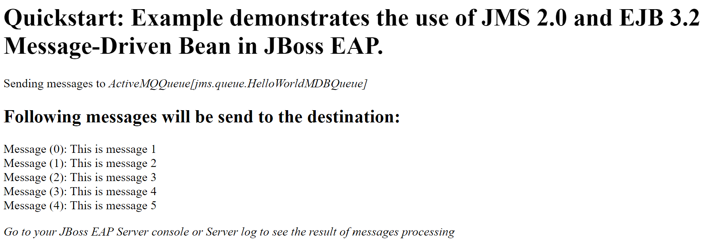

# Run JMS sample on JBoss EAP Azure App Service

This JMS sample is based on https://github.com/jboss-developer/jboss-eap-quickstarts/tree/7.4.x/helloworld-mdb.

You can also refer to https://github.com/RedHat-Middleware-Workshops/eap7-modernization/blob/master/exercise4-messaging.adoc for more detailed description about the sample.

To better understand how message-driven bean is used for processing messages, pls refer to [Receiving Messages Asynchronously Using a Message-Driven Bean](https://docs.oracle.com/javaee/7/tutorial/jms-examples006.htm).

Follow steps below to deploy and run the sample on JBoss EAP Azure App Service:

1. Clone this repo in your local file system.
1. Change directory to sample project `cd <local-clone-of-repo>/jms-helloworld-mdb`.
1. [Configure web app using Azure Web App Maven Plugin](https://docs.microsoft.com/azure/app-service/quickstart-java?tabs=jbosseap&pivots=platform-linux#configure-the-maven-plugin).

   ```azure-cli
   mvn com.microsoft.azure:azure-webapp-maven-plugin:2.5.0:config
   ```
   
   Below is an example of the webapp properties configured: 
   
   ```text
   Subscription Id : <sub-id>
   AppName : jboss-helloworld-mdb-<random-id>
   ResourceGroup : jboss-helloworld-mdb-<random-id>-rg
   Region : centralus
   PricingTier : P1v3
   OS : Linux
   Java : Java 11
   Web server stack: Jbosseap 7
   Deploy to slot : false
   ```

   Log down values for `ResourceGroup` and `AppName`, you will use it later.

1. [Deploy the sample app](https://docs.microsoft.com/azure/app-service/quickstart-java?tabs=jbosseap&pivots=platform-linux#deploy-the-app).

   ```azure-cli
   mvn package azure-webapp:deploy -DskipTests
   ```

   If you encounter the similar error message below, open `pom.xml` and change `region` or `pricingTier` accordingly. 
   ```text
   This region has quota of 0 PremiumV3 instances for your subscription. Try selecting different region or SKU.
   ```
   Re-deploy the sample app until no erros observed.

   Once the app is successfully deployed, you should see the endpoint of web app output in the command prompt.
   ```text
   Successfully deployed the artifact to https://jboss-helloworld-mdb-<random-id>.azurewebsites.net
   ```
   
   Copy the endpoint URL and open it in the browser, you should see the similar UI as below:

   

1. Inspect JBoss EAP server log to see the result of messages processing.
   1. Sign in to [Azure portal](http://portal.azure.com).
   1. Open resource group with the value of `ResourceGroup` you logged down before.
   1. Open the App Service with the value of `AppName` you logged down before.
   1. Open **SSH** page under **Development Tools**. Click **Go** to open a new browser tab for **webssh**.
      1. The path of application log file looks like `LogFiles/Application/server.<random-id>.log`. Replace placeholder `<random-id>` with the real one.
      1. Run `tail -f <path-of-application-log-file> -n 100` to monitor messages processing.
      1. Switch to the UI page of sample app you opened before. Refresh the page.
      1. Swtich back to **webssh** page. You should see the similar messages output.
         ```
         2022-05-25 06:56:20,127 INFO  [class org.jboss.as.quickstarts.mdb.HelloWorldQueueMDB] (Thread-5 (ActiveMQ-client-global-threads)) Received Message from queue: This is message 3
         2022-05-25 06:56:20,127 INFO  [class org.jboss.as.quickstarts.mdb.HelloWorldQueueMDB] (Thread-4 (ActiveMQ-client-global-threads)) Received Message from queue: This is message 2
         2022-05-25 06:56:20,135 INFO  [class org.jboss.as.quickstarts.mdb.HelloWorldQueueMDB] (Thread-3 (ActiveMQ-client-global-threads)) Received Message from queue: This is message 1
         2022-05-25 06:56:20,149 INFO  [class org.jboss.as.quickstarts.mdb.HelloWorldQueueMDB] (Thread-6 (ActiveMQ-client-global-threads)) Received Message from queue: This is message 4
         2022-05-25 06:56:20,216 INFO  [class org.jboss.as.quickstarts.mdb.HelloWorldQueueMDB] (Thread-7 (ActiveMQ-client-global-threads)) Received Message from queue: This is message 5
         ```

1. In the preceding steps, you created Azure resources in a resource group. If you don't need the resources in the future, delete the resource group from portal.

## References

There is a good reference [JBoss EAP on App Service demo](https://github.com/Azure-Samples/jboss-on-app-service) which can help you get started with Jboss EAP on App Service.
